# SEO Jobs Analysis

by Cédric Scherer & Daniel Kupka (FrontPage Data) & Brian Dean (backlinko.com)

# 0. Introduction

We use two data sets:

* Glassdoor data (original) with 908 observations
* LinkedIn data (original) with 62,095 observations
  - subset for "SEO": with 2,387 observations
  - subset for "SEO" and English-speaking offers: with 603 observations

The LinkedIn data contain global job offers while the GlassDoor data only jobs from the US. The LinkedIn data including only job offers with the term `SEO` (or `seo`) contain 2,387 observations from English-speaking countries (USA, Canada, UK, Australia, Ireland, South Africa) and 552 from the USA and the UK (links starting with `www.linkedin.com`).

We merged both data sets and kept as many variables as possible, manually creating new variables for both datasets (GlassDoor: `seniority` and `employment type`; LinkedIn: `sector`) based on text matching of job titles and descriptions. We also removed as many duplictaed entries as possible by matching job title, employer and job location. The final worldwide data set contains 3,127 observations.

Because the job offers are collected from all over the world, a lot of foreign terms are included. Thus, we merged the GlassDoor data also with the English subset of the LinkedIn data and kept again as many variables as possible by manually creating new variables for both data sets. The final "All English" data set contains 1,344 observations.

The GlassDoor data are cleaner with regard to job titles and description than the LinkedIn data. Consequently, some plots using the GlassDoor data do a better job so we provide for now both version (the merged "All English" data set and the GlassDoor data set).

Also, the GlassDoor data contain information that are missing from the LinkedIn data such as `estimated salary range`, `rating`, `employer`, `industry`, and `size (no. of employees)`.

# 1. Job Title

## 1.1 Most Popular SEO Jobs

### Which words are the most popular in the job title?

We analyzed the data on job titles using text mining techniques. In a first step, we tokenize the job titles into single words and visualize their frequency. Stop words and words that appeared less than 7 times were removed to make the graph easier to grasp.

### Which consecutive term sequences are the most popular in the job title?

In a second step, we analyzed sequences of words in the job title. The sorted bar plot shows the most popular consecutive sequences of words (5 or more occurrences), colored by category.

### Are technical terms in job titles more popular? Which technical and non-technical terms are most popular?

We  manually classified in technical and non-technical positions, removing all words that are no specific to any of the both categories:

* technical ~  `analy|special|engine|develop|technic|optimi`
* non-technical ~  `manage|direct|writ|consult|coordinat|edito|market|sale|social|strateg|supervis`

The modified stacked bar plot shows the number of words found per job category and, additionally as another stacked bar next to it, the most common words per category (with labels for words that occured at least 20 times). The height of the stacks indicates as well the number, the width is arbitrary.

# 2. Location

## 2.1 Hot Spots: Cities (Bubble Map)

## 2.2 Hot Spots by States

### Chloropleth Map

This map is derived from spatial locations by intersecting cities with state polygons - thus slightly different numbers compared to the hexagonal grid map which uses states as stated by the source. 

Below is a map based on the location information in the data so same numbers as in the hexagonal tile map:

### Hexagonal Tile Map

## 2.3 Hot Spots by US Counties

# 3. Company Info

## 3.1	Size

#### How large are companies that hire?

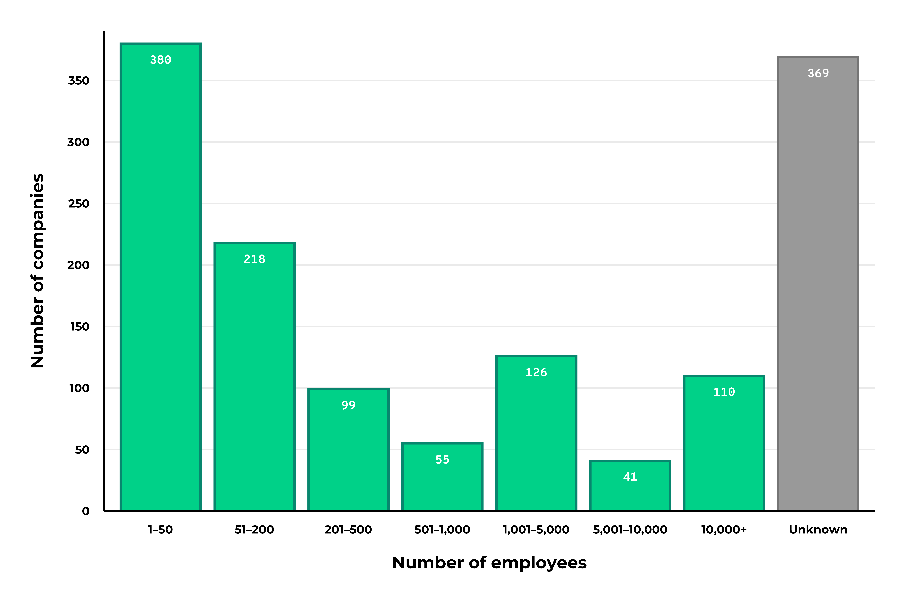

####  (Do larger companies require more specialized tasks?)

CED: What do we define as "more specialized tasks"?

## 3.2	Revenue

#### How much revenue do hiring companies make? 

-> Counts of unique companies per revenue class

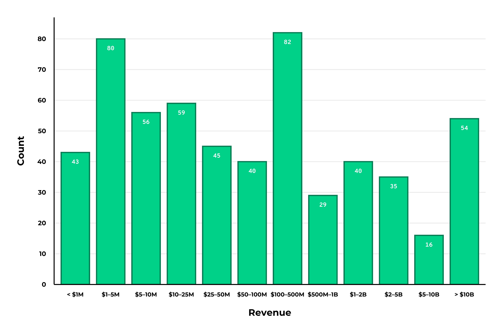

#### What type of skill sets are required by high-revenue companies?

I tokenized the description and removed stop words and numbers as well as manually non-sense/non-skill-related words. There might be more but if we keep it we can have a closer look I would say.

## 3.3	Sector/Industry

#### Which sectors do mainly hire SEOs?

#### Which industries are interested in filling SEO positions?

## 3.4	Company Rating

#### Do more low- or high-rated companies hire? 

-> Counts of unique companies per rating

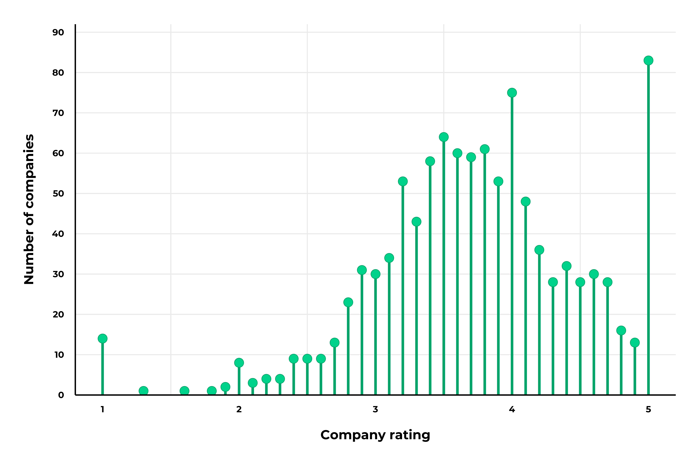

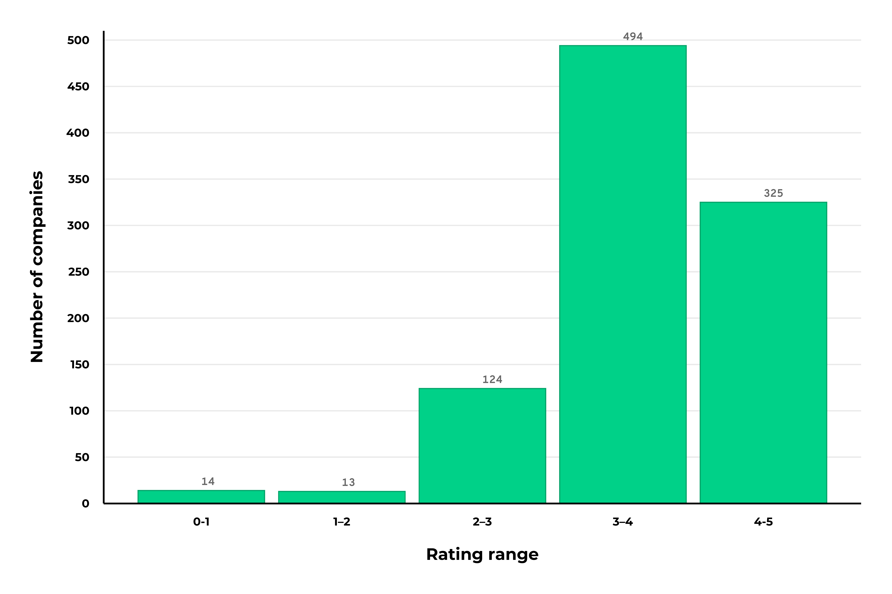

#### Which companies have the highest ratings?

# 4	Job Responsibilities

This is a simple wordcloud of words mentioned in the job descriptions with a frequency of 10 or more. That way, we can scan through the list and select those that are of interest.

Consecutive sequences of words (*ngrams*) in the job desciptions do not bring any insightful, a lot of phrasings and fill words.

# 5	Job Requirements

## 5.1	Education

We extracted from the job descriptions the required/desired degree:

* Bachelors ~ `B.Ba.|B.Sc.|BBa|BSc|BBA|BSC|Bachelors`
* Masters ~ `M.Ba.|M.Sc.|MBa|MSc|MBA|MSC|Masters`
* Doctorates ~ `Ph.D.|PhD|Doctorate`

#### What type of degrees are most often required (Bachelor vs Master vs Doctorate)?

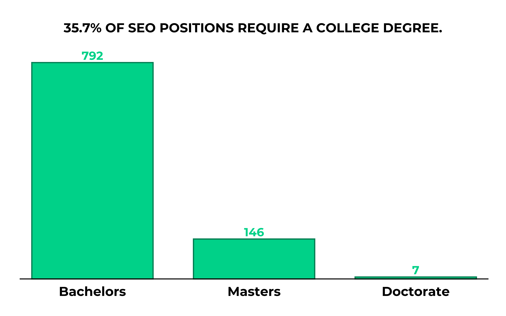

In total we found 39 positions mentioning Bachelors, 10 Masters and only one belonging to the Doctorate category.

#### Do larger companies require a formal education?

#### Which education level is required by high-revenue companies?

-> I've added this since it's a low hanging fruit after the last section ;)  
-> 3 different versions to deal with poverplotting of the x-axis labels

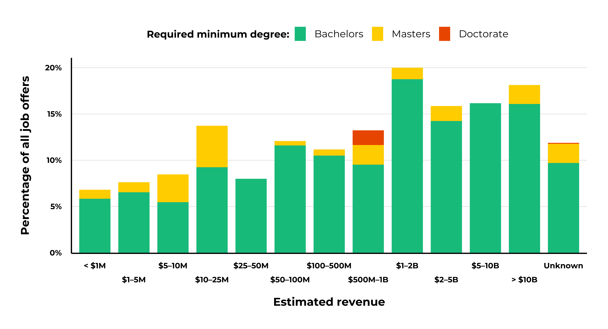

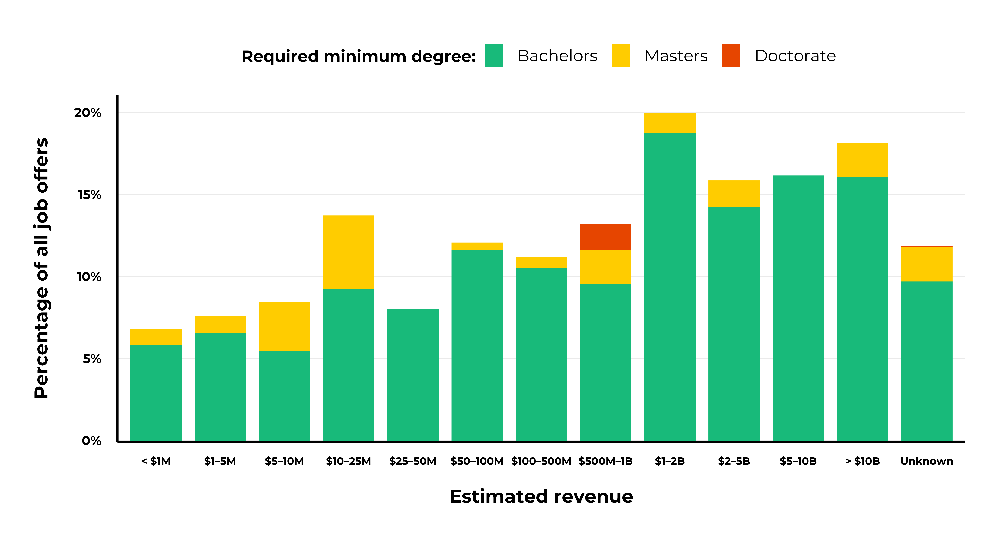

## 5.2 Programming Languages

#### What programming languages are most often required?

I for now use the programming languages listed by the SO yearly survey:
JavaScript, HTML/CSS, SQL, Python, Java, Bash/Shell/PowerShell, C#, PHP, C++, TypeScript, C, Ruby, Go, Assembly, Swift, Kotlin, R, VBA, Objective-C, Scala, Rust, Dart, Elixir, Clojure, WebAssembly + Julia

#### What languages are most often required in combination (e.g. HTML and CSS)

## 5.3	Knowledge of Popular Tools

#### What tools are most often required?

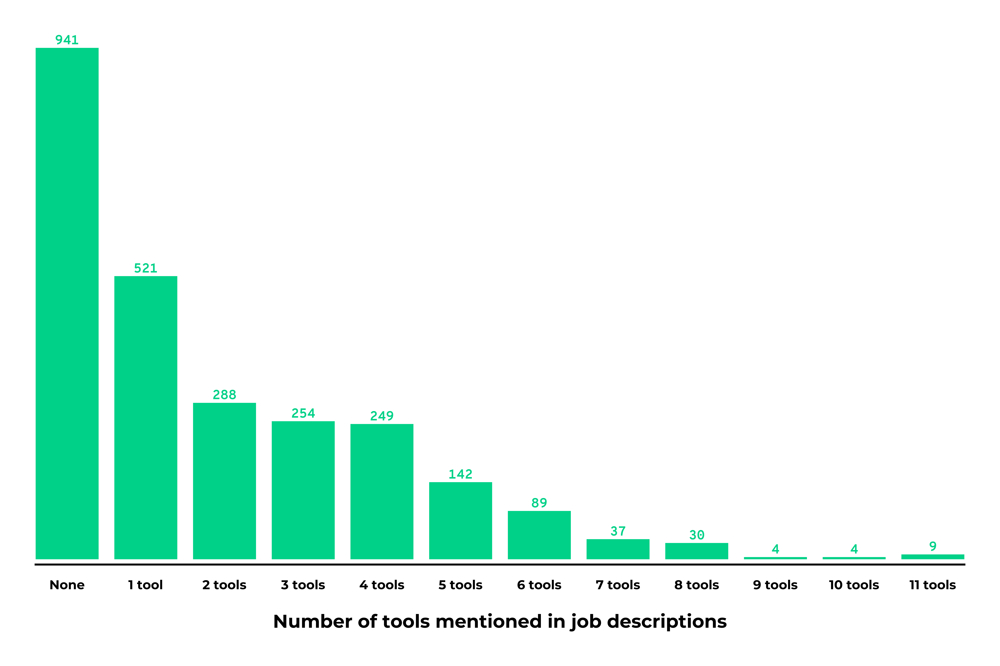

## 5.4	Years of Experience

#### How much experience is required?

Still not sure how to approach that in a better way. For now I have filtered the descriptions for the following strings:

* `[0-9]+ years experience` and `1 year experience`
* `experience: [0-9]+ year`
* `experience [0-9]+ year`
* `experience of [0-9]+ year`

#### (What type of SEO jobs require +5 years experience?)

Given the low number of job offers where years of experience could be easily extracted, I would not go any deeper here and skip this question (at least for now).

# 6	Salaries

## 6.1	Salary Ranges

#### What are the typical salary ranges for SEO jobs?

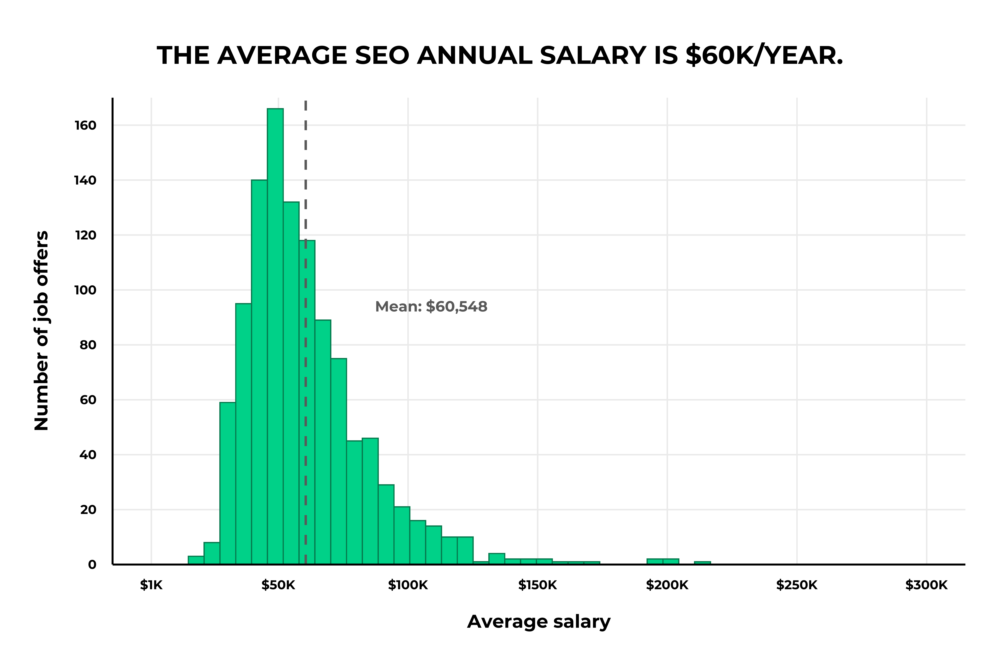

## 6.2	Salaries per Location

#### Where do companies pay the most/least?

## 6.3	Salaries for different positions

#### (What are the highest/lowest paying SEO positions?)

## 6.4	Salaries per job requirement

#### Do positions with programming languages pay significantly more?

## 6.5	Salaries per Company Rating

#### Do lower rated companies pay less (salary)?

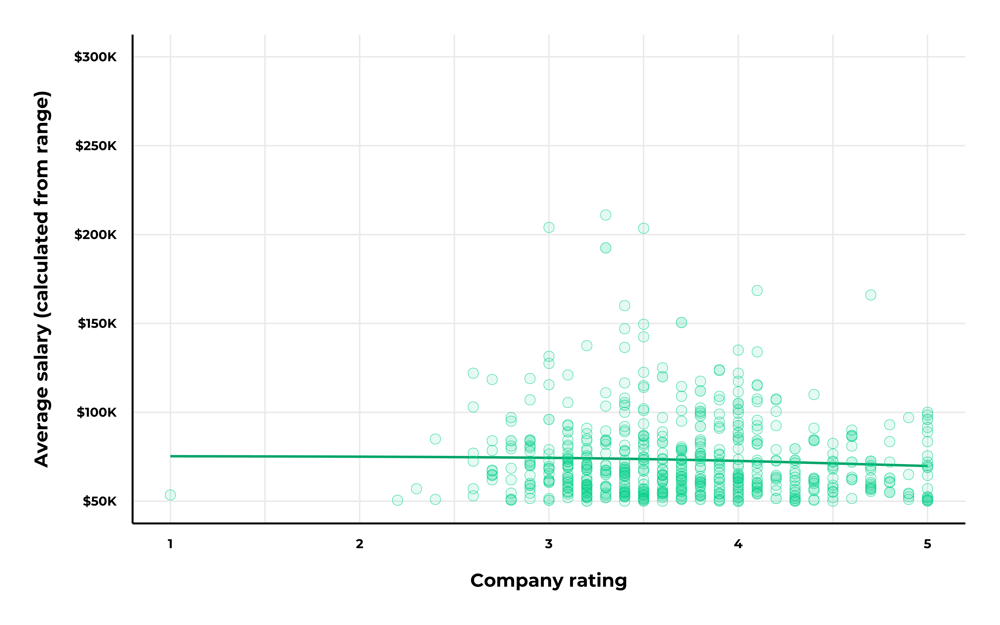

# 7. Dates of Job Offer Posting

## 7.1 Job offers by week and year

Old job offers may not be scraped since they were filled already and removed from/by LinkedIn?! I would not investigate anything with this data at all...

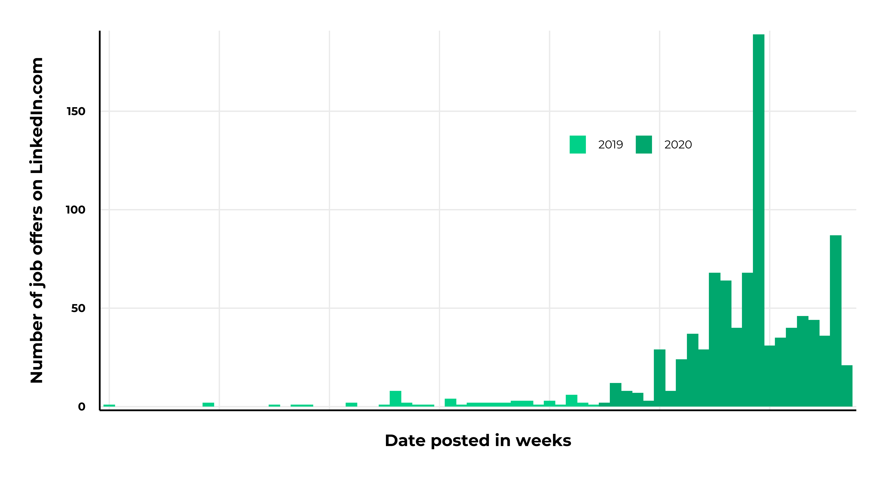

#### Did the number of job offers decline during the COVID-19 pandemic?

## 7.2 Weekday of Posting

#### Are there favorite weekdays for job postings?

