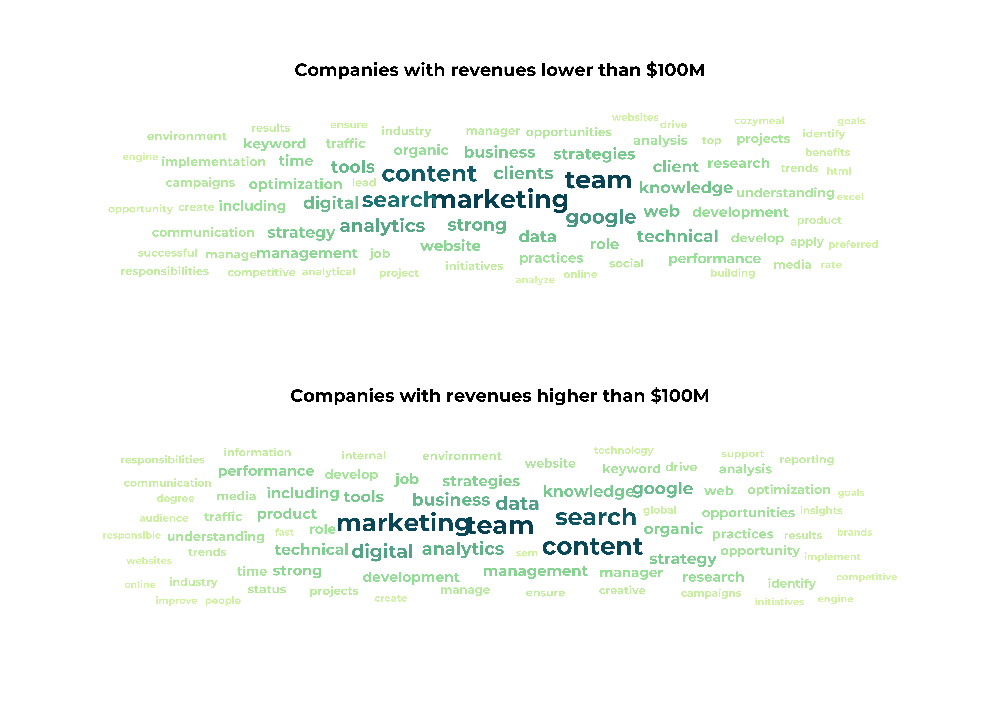
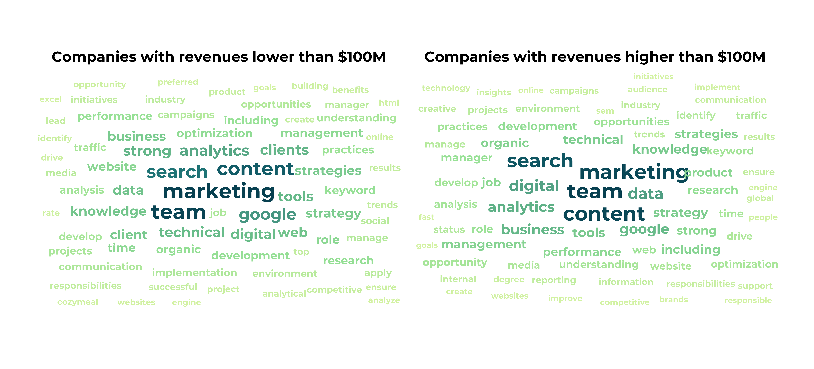

<style>
.list-group-item.active, .list-group-item.active:hover, .list-group-item.active:focus {
  background-color: #00d188;
  border-color: #00d188;
}

body {
  font-family: montserrat;
  color: #444444;
  font-size: 14px;
}

h1 {
  font-weight: bold;
  font-size: 28px;
}

h1.title {
  font-size: 30px;
  color: #00d188;
}

h2 {
  font-size: 24px;
}

h3 {
  font-size: 18px;
}
</style>


```{r setup, include=FALSE}
knitr::opts_chunk$set(echo = FALSE, warning = FALSE, message = FALSE, fig.showtext = TRUE)

knitr::knit_hooks$set(inline = function(x) {
  prettyNum(x, big.mark = ",", small.mark = ",", scientific = F)
})
```


# Internal Comments & Questions

**Section with comments and questions on the analysis and workflow - let's mostly discuss here**

### Job Position Types

We need to agree on names of positions in general and which fall into technical/non-technical groups.

I did some text mining and defined for now technical and non-technical positions manually looking at the resulting list without stop words. I decided to clasify as follows:

* technical ~  `analy|special|engine|develop|technic|optimi`
* non-technical ~  `manage|direct|writ|consult|coordinat|edito|market|sale|social|strateg|supervis`

!!!This is already a very good selection. I would remove engin and optimi as they are part of "Search Engine Optimization". They can be part of both worlds, for example an "Search Engine Optimization Content Writer". Note: May change in the future. Therefore, for now there is now need to report on key takeaways.

I am not sure if all of them are correct (but hopefully most) but e.g. "specialist" is a term I would have another look at. I searched descriptions of specialists and they read as if SEO specialist is a common term for a technical position. Correct?

--> Okay, I have included an adjusted version, keeping the first as well so Brian can decide (or we can go back to it later or simply remove it if it's bs anyway).

## Priorities
!!! I put the more advanced research questions in parentheses. Let´s focus on the basic questions for now. I want to get the basics right. In our last project, we (you) put a lot of effort into the large vs other domains and at the end he did not use them.

--> Argh, in my versio nthis was not included yet so I did all plots with regard to company info beside specialized tasks which is a bit difficult anyway (more detailed comments below for each section). Going to ingore questions in parentheses from now on.

## Salary + education

I have the feeling there is some overlap between section 5.3 and 6 with section 1 where we already look into salary and education. So I would suggest to somehow merge them or reorder them. Assuming you have a simple bar chart or sth similar for simply the three degrees and a histogram of salaries in mind, those shown in section one are way more detailed by looing at the company's size and rating.

## Job Tasks

I've added word clouds for both words and consecutive sequences of terms found in the job description (removed "seo" and terms which occurred less than 10 times). Do you provide any list out of these? If you want to have a look at the list, I have first generated the data frame and then plotted it so we can also have a look into the list and filter it manually etc.

## "Deep Dive" into Tasks

I am not sure what exactly you have in mind here. Since I already decided to show the subset of technical versus non-technical jobs this feels a bit repetitive. But I might be wrong - here we look into the description,  in section 1 I used the job title. Let's see once we have the list of tasks.

## Programming Languages + Tools

In section 5.1 U have used the programming languages listed in the yearly survey of StackOverflow and added Julia (because I know it and wondered why it's missing - not included anyway).

I assume for tools (section 5.2) you mean non-programming tools to be included (as well or only those?). Can you come up with a list here? I might run out of tools used in this context very soon (I would include tools such as Power BI and Tableau?!).


# 0. Data

We have two original data sets:

* Glassdoor data (original) with 908 observations
* LinkedIn data (original) with 62,095 observations

The LinkedIn data contain global job offers while the GlassDoor data only jobs from the US. The LinkedIn data contain 27,869 observations from English-speaking countries (USA, Canada, UK, Australia, Ireland, South Africa) and 23,817 from USA and UK (links starting with `www.linkedin.com`).

We merged both data sets and kept as many variables as possible, manually creating new variables for both datasets (GlassDoor: `seniority` and `employment type`; LinkedIn: `sector`) based on text matching of job titles and descriptions. The final worldwide data set contains 63,003 job offers.

Because the job offers are collected from all over the world, a lot of foreign terms are included. Thus, we merged the GlassDoor data also with the English subset of the LinkedIn data and kept again as many variables as possible by manually creating new variables for both data sets. The final "All English" data set contains 28,777 job offers.

The GlassDoor data are cleaner with regard to job titles and description than the LinkedIn data. Consequently, some plots using the GlassDoor data do a better job so we provide for now both version (the merged All English data set and the GlassDoor data set).

Also, the GlassDoor data contain information that are missing from the LinkedIn data such as `estimated salary range`, `rating`, `employer`, `industry`, and `size (no. of employees)`.


# 1. Job Title

## 1.1 Most Popular SEO Jobs

### Which words are the most popular in the job title?

We analyzed the data on job titles using text mining techniques. In a first step, we tokenize the job titles into single words and visualize their frequency. Stop words and words that appeared less than 7 times were removed to make the graph easier to grasp.


#### All English:


#### GlassDoor:


### Which consecutive term sequences are the most popular in the job title?

In a second step, we analyzed sequences of words in the job title. The sorted bar plot shows the most popular consecutive sequences of words (5 or more occurrences), colored by category.


#### All English:


#### GlassDoor:

Less categories thus a bit easier to read.


### Are technical terms in job titles more popular? Which technical and non-technical terms are most popular?

We  manually classified in technical and non-technical positions, removing all words that are no specific to any of the both categories:

* technical ~  `analy|special|engine|develop|technic|optimi`
* non-technical ~  `manage|direct|writ|consult|coordinat|edito|market|sale|social|strateg|supervis`

The modified stacked bar plot shows the number of words found per job category and, additionally as another stacked bar next to it, the most common words per category (with labels for words that occured at least 20 times). The height of the stacks indicates as well the number, the width is arbitrary.


#### All English:


#### GlassDoor:


# 2. Location

## 2.1 Hot Spots Worldwide

Still missing geocodes, not able to scrape them currently (limit reached?)


## 2.2 Hot Spots North America

The "All English" dataset projected on the North American continent:


(Light version: It was hard to see the dots so I turned it into a dark version. Work in progress, not happy yet.)


## 2.3 Hot Spots US Cities

A bubble map showing company locations by city (excluding "states", "worldwide" and "remote").


Version with the Backlinko cyan as outline:


## 2.4 Hot Spots US States

A chloropleth hexagonal map showing company locations by state (excluding "states", "worldwide" and "remote"). Hexagonal tile maps are useful to remove the effect of area (i.e. our variable "job offers" is not realted to a state's area).

**STILL HAVE TO FIX NUMBERS!**


Version with the Backlinko cyan as outline:


# 3. Company Info

## 3.1	Size

#### How large are companies that hire?


#### (Do larger companies require more specialized tasks?)

--> ??? What do we define as "more specialized tasks"?


#### (Do larger companies require a formal education?)

We extracted from the job descriptiosn the required/desired degree:

* Bachelors ~ `B.Ba.|B.Sc.|BBa|BSc|BBA|BSC|Bachelors`
* Masters ~ `M.Ba.|M.Sc.|MBa|MSc|MBA|MSC|Masters`
* Doctorates ~ `Ph.D.|PhD|Doctorate`


In total we found 39 posisition mentioning Bachelors, 10 Masters and only one with Doctorate.


## 3.2	Revenue

#### Which education level is required by high-revenue companies?

-> I've added this since it's a low hanging fruit after the last section ;)
-> 3 different versiomn to deal with poverplotting of the x-axis labels


#### (What type of skill sets are required by high-revenue companies?)

--> ??? Can you come up with a list or should I try to extract common words? Don't know yet how to determine those terms between skills and... yeah, what does mark the end of the skill section?

--> So I tokenized the description and removed stop words and numbers as well as manually non-sense/non-skill-related words. There might be more but if we keep it we can have a closer look I would say. Only later realized it has less priority. However, these wordclouds can be used in another context for sure anyway.







## 3.3	Sector/Industry

#### Which sectors do mainly hire SEOs?


#### Which industries are interested in filling SEO positions?


## 3.4	Company Rating

#### (Do lower rated companies pay less (salary)?)


#### (Which companies have the highest ratings?)


# 4	Job Responsibilities

!!! For section 4. and 5.: To get the words we are looking for, it would be useful to see a simple wordcloud or a df which the tokenized words (single words and bigrams). That way, we can scan through the list and select those that fit to job tasks, programming language, knowledge of popular tools, etc. What do you think? Open to other appraoches.   

Words in the job desciptions with a frequency of 10 or more:


Consecutive sequences of words (*ngrams*) in the job desciptions with a frequency of 10 or more:


## 4.1	Job related tasks

#### What job tasks are most often mentioned?


## 4.2	Deep dive into job tasks (PPC, content management, technical, etc.)

#### What technical SEO tasks are most often required?

--> How will this differ to 1.1 where we look at technical vs non-technical positions? Since I already showed the most common terms here i think it is (almost?) the same plot.


# 5	Job Requirements

## 5.1	Programming Languages

#### What programming languages are most often required?

I for now use the programming languages listed by the SO yearly survey:
JavaScript, HTML/CSS, SQL, Python, Java, Bash/Shell/PowerShell, C#, PHP, C++, TypeScript, C, Ruby, Go, Assembly, Swift, Kotlin, R, VBA, Objective-C, Scala, Rust, Dart, Elixir, Clojure, WebAssembly + Julia


#### What languages are most often required in combination (e.g. Html, CSS)


## 5.2	Knowledge of Popular Tools

#### What tools are most often required?

--> What's the difference to 5.1, including i.e. Power BI? Do you provide a list of common tools?


## 5.3	Years of Experience

#### What type of SEO jobs require +5 years experience?

--> Simply filter by "5+ years"? Or search for years and extract number? How to evaluate if they use different ways to say the same?


## 5.4	Degree Requirements

#### What type of degrees are most often required (BS vs MS vs None)?

--> Did this already for company info - any other relationship of interest here? Or a simple bar plot showing the three educaiton levels summarized and not for each company size/salary?


# 6	Salaries

## 6.1	Salary Ranges

#### What are the typical salary ranges for SEO jobs?


## 6.2	Salaries per Location

#### Where do companies pay the most/least?


## 6.3	Salaries for different positions

#### What are the highest/lowest paying SEO positions?


## 6.4	Salaries per job requirements

#### Do positions with programming languages pay significantly more?